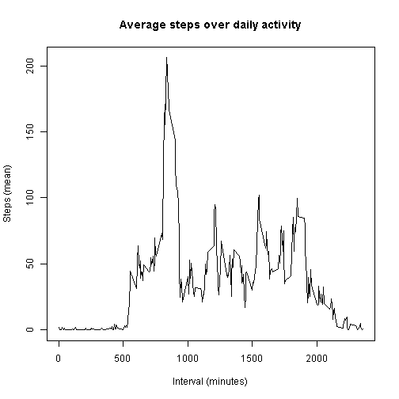

# Reproducible Research: Peer Assessment 1


## Loading and preprocessing the data


```r
# This function fetches the Activity monitoring data and store it into a data frame

fetch_data <- function() {
    
    file_url <- "https://d396qusza40orc.cloudfront.net/repdata%2Fdata%2Factivity.zip"
    zip_name <- "./activity.zip"
    csv_name <- "./activity.csv"
    
    activity_df <- data.frame()
    
    # Download zip file if not found
    if(file.exists(zip_name) == FALSE) {
        download.file(file_url,zip_name)  
        }
    
    # Unzip data set if not done already
    if(file.exists(csv_name) == FALSE) {
        unzip(zip_name)
        }
    
    activity_df <- read.csv(csv_name, na.strings="NA", stringsAsFactors=TRUE)
    
    return(activity_df)
    }

# Print a summary of the data

activities <- fetch_data()

head(activities)
```

```
##   steps       date interval
## 1    NA 2012-10-01        0
## 2    NA 2012-10-01        5
## 3    NA 2012-10-01       10
## 4    NA 2012-10-01       15
## 5    NA 2012-10-01       20
## 6    NA 2012-10-01       25
```

Another way to observe the data distribution is to plot a graph of steps 
taken each day:


```r
library(reshape)

# Reshape data, summing up steps from each day
molten <- melt(activities, id=c("date", "interval"), measured="steps", na.rm=F)
steps_day <- cast(molten, date ~ . , sum, na.rm=T)

# Fix colnames
colnames(steps_day) <- c("date", "steps")

# Dates to be used as labels in the x axis
dates <- unique(activities$date)

plot(as.numeric(steps_day$date), steps_day$steps, type="b",
     ylab="steps", xlab="days", main ="Total steps per day", xaxt="n")
axis(1, at=1:length(dates), labels=dates, tick =T)
```

 

## What is the mean total number of steps taken per day?

And we can plot a histogram of total number of steps for each day:

```r
# Now we plot the histogram of steps each day
hist_data <- tapply(steps_day$steps, steps_day$date, sum)

hist(hist_data,  ylab="Frequency", xlab="steps/day", main ="Total number of steps taken each day", breaks=60)
```

 

Since the steps for each day have already been calculated above, all we need to
do now is calculate the mean and meadian:


```r
# Mean steps
mean(steps_day$steps)
```

```
## [1] 9354
```

```r
# median steps
median(steps_day$steps)
```

```
## [1] 10395
```


## What is the average daily activity pattern?

To calculate the average activity pattern, we reshape the data set, calculating the
mean steps over each interval across all days:

```r
# Reshape data, summing up steps taken for each interval over all days
molten <- melt(activities, id=c("date", "interval"), measured="steps", na.rm=T)
avg_day <- cast(molten, interval ~ . , mean)
colnames(avg_day) <- c("interval", "steps")

plot(avg_day, type='l', ylab="Steps (mean)", xlab="Interval (minutes)",
     main ="Average steps over daily activity")
```

 

To calculate the interval with the maximum average number of steps, we use the
which.max function over the avg_day data set:

```r
index <- which.max(avg_day[,2])

# Interval and average step value
avg_day[index,]
```

```
##     interval steps
## 104      835 206.2
```


## Imputing missing values

To calculate the sum of the missing values, we use the is.na over the original
data set:


```r
sum(is.na(activities))
```

```
## [1] 2304
```

To fill in the missing values from the original dataset, we will use the mean
values of each 5-minute interval averaged over days.


```r
# First, make a copy of the original data set 

activities_new <- activities

# Second, iterate over the entire data set
rowSize <- dim(activities_new)[1]
for(i in 1:rowSize) {
    
    # Check if step is NA
    if(is.na(activities_new[i,"steps"]) == T) {
        
        # Calculate the index of the interveal value associated with that NA value
        step_index <- which(avg_day[,1] == activities_new[i,"interval"])
        
        # Replace the NA value with the average of interval values
        activities_new[i,"steps"] <- avg_day[step_index,"steps"]          
    }
}
```

With the new data set, we plot its histogram:


```r
hist_data_new <- tapply(activities_new$steps, as.factor(activities_new$date), sum)

hist(hist_data_new,  ylab="Frequency", xlab="steps/day", main ="Total steps taken each day", breaks=60)
```

 

And now we calculate the new mean and median values:


```r
# First, reshape the data set to sum all steps over each day
molten_new <- melt(activities_new, id=c("date", "interval"), measured="steps")
steps_day_new <- cast(molten_new, date ~ . , sum)
colnames(steps_day_new) <- c("date","steps")

# Mean steps
mean(steps_day_new$steps)
```

```
## [1] 10766
```

```r
# median steps
median(steps_day_new$steps)
```

```
## [1] 10766
```

In the new data set, the histogram of total number of steps per day changed. The frequency of around the center of the histogram rised, since the days with missing data were filled with the same averaged number of steps, located around the middle of the histogram. Because the mean in the missing days is  exactly in the middle of the distribution of steps per day, the new median and mean are equal.


## Are there differences in activity patterns between weekdays and weekends?

First, we add a new factor variable to distinguish weekdays and weekends: 

```r
# Change dates to english
Sys.setlocale("LC_TIME", "C")
```

```
## [1] "C"
```

```r
activities_new$weekdays <- factor(format(as.Date(activities_new$date),"%A"))

levels(activities_new$weekdays) <- list(
    weekday = c("Monday", "Tuesday", "Wednesday", "Thursday", "Friday"),
    weekend = c("Saturday", "Sunday")
    )
```

Afther that, we calculate the average number of steps taken over weekdays and
weekends, and plot them


```r
library(lattice)

activities_new_avg<- aggregate(activities_new$steps,list(
    interval = as.numeric(as.character(activities_new$interval)), 
    weekdays = activities_new$weekdays),
    FUN = "mean"
    )

colnames(activities_new_avg) <- c("Interval", "Weekdays", "Means")

xyplot(Means ~ Interval | Weekdays,
       data = activities_new_avg,
       layout = c(1, 2), type = "l", 
       xlab = "Interval", ylab = "Steps",
       main="Average Number of Steps Accross weekdays and weekends")
```

 

From the plots above, we can observe that during weekdays the individual is highly active during the 500-100 interval, while on weekends the activities are more evenly distributed throughout the day.

